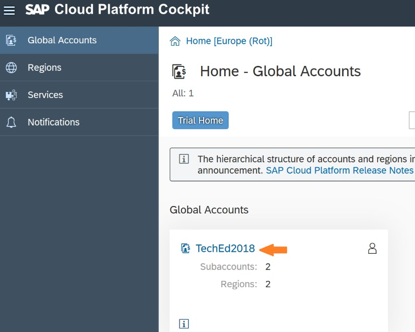
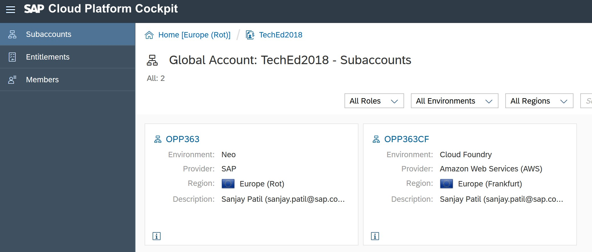
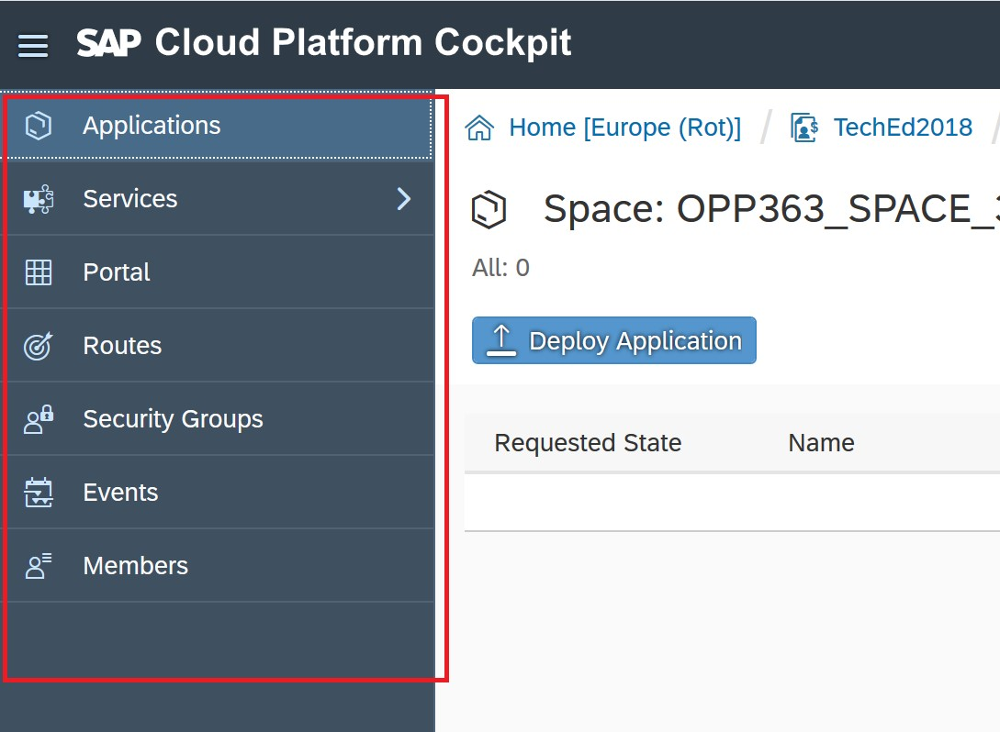
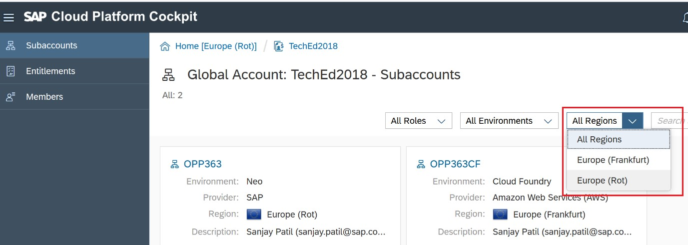

- - - -
Previous Exercise: [Exercise 01 Setup](../Exercise-01-Setup) Next Exercise: [Exercise 3 - Publish Wishlist](../Exercise-03-Publish-Wishlist)

[Back to the Overview](../README.md)
- - - -

# Exercise 02 - Basic Understanding of Org and Space.

## Introduction 
On SAP Cloud Platform - Cloud Foundry you will hear terms like Global account, Organization, Spaces, api endpoint. In this document we will explain those terms: 

1.	When you login to [SAP Cloud Platform cockpit](https://account.eu1.hana.ondemand.com/cockpit#/home/allaccounts), with your student credentials, you will see the home page which has Global Accounts. 

.

Global Accounts: Global accounts are hosted environments that represent the scope of the functionality and the level of support based on a customer or partner’s entitlement to platform resources and services. 
A global account can contain one or more subaccounts in which you deploy applications, use services, and manage your subscriptions. More on [help guide](https://help.sap.com/viewer/e275296cbb1e4d5886fa38a2a2c78c06/Cloud/en-US/c165d95ee700407eb181770901caec94.html?q=global%20accounts) 

2.	On the left side you will see the regions on which SAP Cloud Platform is available, Services that can be used and different notifications.  

.

3.	Click on the link with text TechEd2018. 

.

4.	Here you will see two tiles which are subaccounts. In productive scenarios these would be your Dev, QA and Production accounts.  OPP363 is the tile for neo environment and OPP363CF for Cloud Foundry environment. For the scope of this hands on we will work on OPP363CF. These are different environments on which SAP Cloud Platform is available. See our help guide to know more about [SAP Cloud Platform Environments](https://help.sap.com/viewer/65de2977205c403bbc107264b8eccf4b/Cloud/en-US/ab512c3fbda248ab82c1c545bde19c78.html).  For more information refer the links below on the cockpit.

.

Subaccounts: Is the place where you can deploy applications, use services, and manage subscriptions on SAP Cloud Platform.

5.	On left you can see the Entitlements and Members to your Global account.

.

6.	Click on Entitlements to see the quota available to the Global account and to which subaccount it is assigned. Scroll below and check the memory assigned to OPP363CF.

.

7.	Click on Subaccounts to go back.

8.	Click on OPP363CF to go the Organization overview page. This subaccount has multiple spaces one per participant.

.

.

9.	On left you can see the Spaces, Connectivity, Security, Quota Plans assigned to your space, and the Members. For this hands on you will primarily use Destinations under Connectivity, for outbound communication. Refer our [help guide](https://help.sap.com/viewer/cca91383641e40ffbe03bdc78f00f681/Cloud/en-US/7e306250e08340f89d6c103e28840f30.html) to know more about Destinations. 

.

Spaces: A space provides users with access to a shared location for application development, deployment, and maintenance.  More information on our [help guide](https://help.sap.com/viewer/e275296cbb1e4d5886fa38a2a2c78c06/Cloud/en-US/8426b2c65ebe4b1fa3ad9e1e571a2f28.html) 

10.	On right you can see the API endpoint and subaccount details. This is the API endpont that was used for SAP Web IDE Full-Stack  configuration in the previous exercise. 

.

API Endpoint: The API endpoint, or target URL, for your Cloud Foundry instance is the URL of the Cloud Controller. More information on our [help guide](https://help.sap.com/viewer/65de2977205c403bbc107264b8eccf4b/Cloud/en-US/350356d1dc314d3199dca15bd2ab9b0e.html)

11.	Click on Spaces. 

.

12.	Here you can see the space and the related information like started and stopped applications, quota assigned.
.

Make sure you have the available resources as highlighted above. 

13.	Click on your space name.  

.

14.	This is the overview page of the space, and the operations that you can perform with the resources available to your space. 

.

15.	On left you can see Application, Services and other usefull tabs. Applications tab is the place where you can see your deployed apps, Under Services tab you have Service marketplace which lists all the services that are made avaialble to you for this hands on, and Service Instances where you can see the instances that your application is using. 

.

16.	Click on Service, to expand it. 
.
17.	Click on Service Marketplace. This shows you all the services available to your space which your applications can use 

.
18.	Click on Service Instances. This is the place where you will be able to see the instances of the services that you have created, and the applications are using it. 
.

User provided Service: User-provided service instances enable you to use services that are not available in the marketplace with your applications running in the Cloud Foundry environment. More information on our [help guide](https://help.sap.com/viewer/65de2977205c403bbc107264b8eccf4b/Cloud/en-US/a44355e200b44b968d98ddaa42f07c3a.html?q=User-Provided%20Services) 

Now you are familiar with basic terminologies and actions to be performed on SAP Cloud Platform cockpit, below are few steps that will help you to take action faster: 

19.	Click as highlighted below to go to your Home page. 

.

20.	Click on the Tech2018 text to view the regions where your subaccounts are created.  
.

21.	Click as highlighted below to go to your Global account.  
.

22.	Click as highlighted below to go to your subaccounts/Org.  
.

23.	Click as highlighted below to go to your space.  

.

The number 397 will be different for you, it will be your student number.

- - - -
© 2018 SAP SE
- - - -
Previous Exercise: [Exercise 01 Setup](../Exercise-01-Setup) Next Exercise: [Exercise 3 - Publish Wishlist](../Exercise-03-Publish-Wishlist)

[Back to the Overview](../README.md)
