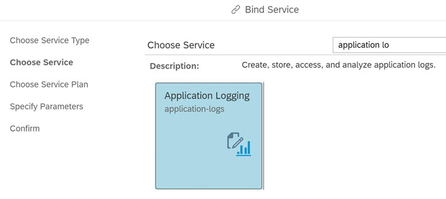
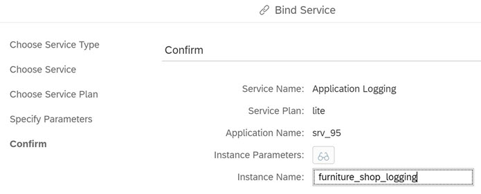
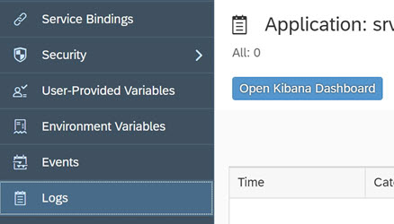

- - - -
Previous Exercise: [Exercise 4 - Order New Items](../Exercise-04-Order-New-Items) Next Exercise: [Exercise 6 - Comments and Ratings Backend](../Exercise-06-Comments-and-Ratings-Backend)

[Back to the Overview](../README.md)
- - - -
# Exercise 05 - Logging

## Why is logging important?
- No debugging of microservices in production.
- Debug port is closed by default.
- Applications must be SOX-compliant - immutable.
- We may have multiple instances so it may be difficult to target/troubleshoot specific instances.

We want to be able to look back in time, identify corresponding requests, which version of software was running at that time, which methods were being called etc.

The logs we collect are only useful if they can be analysed and visualised easily. It is helpful toto be able to collect logs in a single location and preferably in a common format.

In this exercise, you will learn how you as an application developer or a dev ops engineer can visualize the application logs provided by default via Cloud Foundry ELK stack which provides elastic search, logstadsh (data processor and enrichment of logs) and Kibana. This is a good combination to store, search and visualise log entries.

## 1. Review Logging Configuration and Code

In Exercise 2, we added the backend serivce calls to our wishlist application. As part of this exercise, we included the logging configuration and code to avoid having to build and redeploy the application again just to include the logging. 

1. In your Web IDE Full-stack open mta.yaml.
2. Under the srv module, nocite how we have already got the logging level set to `info` using the property:
```
    properties: 
      SET_LOGGING_LEVEL: '{com.company.furnitureshop: INFO}'    
```
2. Next, open `BackendService.java` under  `srv\src\main\java\com\company\furnitureshop\`. 
3. Notice the info logging entries, for example:
```
logger.info("Class:BackendService - now in @Query getProducts()");
```


There is no need to change any code. We will need to bind an instance of the application-logs service in the next step.

## 2. Create and Bind a Service of application-logs
We will need to create and bind an instance of the application logging service to our application.
1. In the SAP Cloud PLatform Cockpit, go to your _Space-your space-applications-your application_.
2. From the application overview, click _Service Bindings_ on the left menu.


3. Click _New Binding_.


4. In the _Bind Service_ wizard, for _Choose Service Type_ select `Service from the catalog`.


5. Click _Next_.
6. Search for `Application Logging`, select it.



7. Click _Next_.
8. For _Plan_ select `lite`.


9. Click _Next_.
10. For _Parameters_ leave everything blank.
11. Click _Next_.
12. For _Instance Name_, enter `furniture_shop_logging`.



13. Click _Finish_.
14. Your Service Bindings should now include `furniture_shop_logging`.


15. From the _Overview_ for your application restart your application.

## 3. Generate, and View Logs in Kibana
In this step, we will explore how easy it is to view and analyze your logs using the Kibana Dashboard. An alternative would be to view the application logs using the Cloud Foundry command line tools, ie `cf logs application name --recent`. This, however is difficult to work with.

1. Open the wishlist application in your browser and view a few products and their backend product details.
2. Return to the SAP Cloud Platform Cockpit.
3. Click _Logs_ on the left menu.



4. Click the _Open Kibana Dashboard_ button.
5. Log in user your SAP Cloud Platform User and Password.
6. Lets take a look at the different dashboards within Kibana.
   - _Overview_
     This shows the organization(s), space(s) of which you are a member (you        only see those logs). You can filter by organization or space. 
   - _Usage_ 
     To check usage which endpoints are called how often.
   - _Performance and Quality_
     Analyze request timeline further.
   - _Requests and Logs_
     Helps you to view, search and analyze the actual log messages.

7. We will start by changing a few settings. Click the configuration on the top right to set the timeline (last 15 minutes, current day etc) and enable autorefresh.
8. Next, Click _Requests and Logs_.
9. In the requests list, you can filter out unwanted requests using the mignifying glass(-) button when you hover over an item (so you can filter for a specific component or log level).


10. You can also add columns to the display. Expand a request in the list and scroll down to view the attributes of that request. Hover your mouse over the attribute of interest and click the _Toggle Colum in Table_ button to add that attribute to the column view.


11. The column is now added to the view:


12. You can add filters by correlation id to group together the logs for that correlation id. This will filter the Requests list and Application Log list for the correlation id. 

13. To use the same filters across other dashboards you need to first pin them. Hover over the filter and click the _Pin_ icon.


- - - -
© 2018 SAP SE
- - - -
Previous Exercise: [Exercise 4 - Order New Items](../Exercise-04-Order-New-Items) Next Exercise: [Exercise 6 - Comments and Ratings Backend](../Exercise-06-Comments-and-Ratings-Backend)

[Back to the Overview](../README.md)
