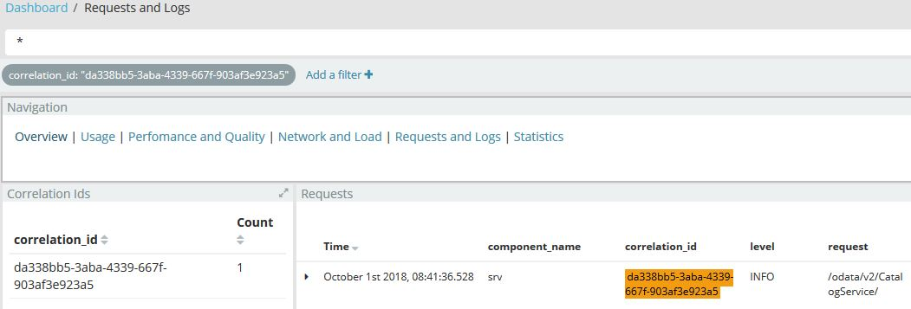

<a name="top"></a>
# Exercise 5 - Logging

## Navigation

| Previous | | Next
|---|---|---|
| [Exercise 4 - Order New Items](../Exercise-04-Order-New-Items) | [Overview](../README.md) | [Exercise 6 - Comments and Ratings Backend](../Exercise-06-Comments-and-Ratings-Backend)


## Table of Contents
* [Why is Logging Important?](#Intro)
* [Review Logging Configuration and Code](#Step1)
* [Create and Bind a Service of application-logs](#Step2)
* [Generate and View Logs in Kibana](#Step3)


<a name="Intro"></a>
# Why is Logging Important?

- No debugging of micro-services in production
- Debug port is closed by default
- Applications must be SOX-compliant - therefore immutable
- We may have multiple instances so it may be difficult to target/troubleshoot specific instances

We want to be able to look back in time, identify corresponding requests, which version of software was running at that time, which methods were being called etc.

The logs we collect are only useful if they can be analysed and visualised easily. It is helpful to be able to collect logs in a single location and preferably in a common format.

In this exercise, you will learn how you as an application developer or a dev ops engineer can visualize the application logs provided by default via Cloud Foundry ELK stack which provides elastic search, logstash (data processor and enrichment of logs) and Kibana. This is a good combination to store, search and visualise log entries.

[Top](#Top)


<a name="Step1"></a>
# 1. Review Logging Configuration and Code

In Exercise 4, we added the backend service calls to our wishlist application. As part of this exercise, we included the logging configuration and code to avoid having to build and redeploy the application again just to include the logging. 

1. In your Web IDE open `mta.yaml`
1. Under the `srv` module, notice how we have already got the logging level set to `info` using the property:

    ```yaml
    properties: 
      SET_LOGGING_LEVEL: '{com.company.furnitureshop: INFO}'    
    ```

1. Next, open `BackendService.java` under  `srv\src\main\java\com\company\furnitureshop\`. 
1. Notice that there are several info logging entries, for example:

    ```java
    logger.info("Class:BackendService - now in @Query getProducts()");
    ```

    

    There is no need to change any code. We will bind an instance of the `application-logs` service in the next step.

[Top](#Top)


<a name="Step2"></a>
## 2. Create and Bind a Service of application-logs

We will now create and bind an instance of the application logging service to our application.

1. In the SAP Cloud Platform Cockpit, go to the Applications in your _Space_ and click on the `srv` app.
1. From the application overview, click _Service Bindings_ on the left menu.
1. Click _Bind Service_.

    

1. In the _Bind Service_ wizard, for _Choose Service Type_ select `Service from the catalog`.

    

1. Click _Next_.
1. Search for `Application Logging`, select it.

    

1. Click _Next_.
1. For _Plan_ select `lite`.

    

1. Click _Next_.
1. For _Parameters_ leave everything blank.
1. Click _Next_.
1. For _Instance Name_, enter `furniture_shop_logging`.

    

1. Click _Finish_.
1. Your Service Bindings should now include `furniture_shop_logging`.

    

1. From the _Overview_ for your application restart your application.

[Top](#Top)


<a name="Step3"></a>
# 3. Generate and View Logs in Kibana

In this step, we will explore how easy it is to view and analyze your logs using the Kibana Dashboard. 

Alternatively, you could view the application logs in the cockpit or by using the Cloud Foundry CLI tools, ie `cf logs <app-name> --recent`. 

1. In order to collect new logs after binding the Application Logging instance to the `srv` application you will need to run the application once to generate the logs. Open the wishlist application in your browser and view a few products and their backend product details.

1. Return to the SAP Cloud Platform Cockpit.

1. Click _Logs_ on the left menu.

    

1. Click the _Open Kibana Dashboard_ button.

1. Log in user your SAP Cloud Platform User and Password.

1. Lets take a look at the different dashboards within Kibana.

   - ***Overview***  
     This shows the organization(s), space(s) of which you are a member (you        only see those logs). You can filter by organization or space. 

   - ***Usage***  
     To check usage which endpoints are called how often.

   - ***Performance and Quality***  
     Analyze request timeline further.

   - ***Requests and Logs***  
     Helps you to view, search and analyze the actual log messages.
     
    

1. We will start by changing a few settings. In the top right, click where its says "Last 15 minutes".  To the left of this text, an auto-refresh button will appear, and a list of intervals will appear below and to the left.  Select some appropriate value such as "30 seconds".

1. Next, Click _Requests and Logs_.

1. In the requests list, when you hover over an item, to the right a pair of magnifying glass buttons appear.  These are used to filter in/out specific components or log levels.

    

1. You can also add columns to the display. Expand a request in the list and scroll down to view the attributes of that request. Hover your mouse over the attribute of interest and click the _Toggle Column in Table_ button to add that attribute to the column view.

    

1. The column is now added to the view:

    

1. You can add filters by correlation id to group together the logs for that correlation id. This will filter the Requests list and Application Log list for the correlation id. 

    

1. To use the same filters across other dashboards you need to first pin them. Hover over the filter and click the _Pin_ icon.

    

1. In the _Application Logs_ pane, select any entry and click the arrow in the table to axpand that entry.

    

1. You can switch between the _table_ and _JSON_ view using the tabs. Click the JSON tab to view the expanded application log entry in JSON format. 

    

This concludes our brief introduction to application logging and how logs can be processed, enriched and visualised using Kibana.

[Top](#Top)


<hr>
© 2018 SAP SE
<hr>


## Navigation

| Previous | | Next
|---|---|---|
| [Exercise 4 - Order New Items](../Exercise-04-Order-New-Items) | [Overview](../README.md) | [Exercise 6 - Comments and Ratings Backend](../Exercise-06-Comments-and-Ratings-Backend)
