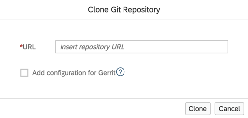
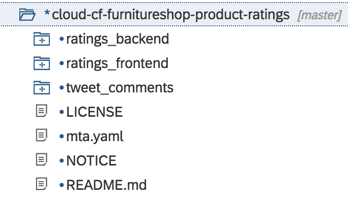
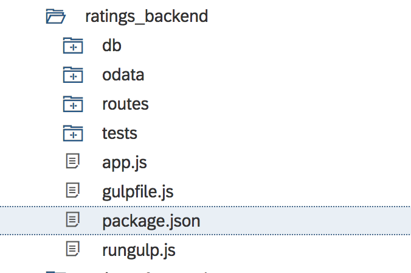
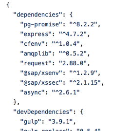
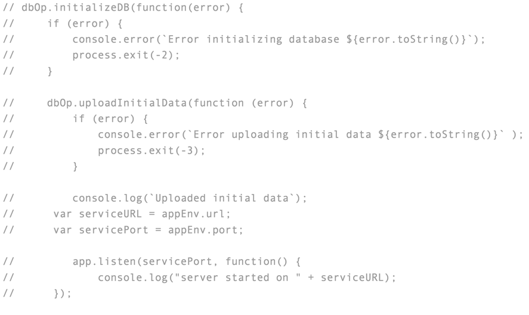
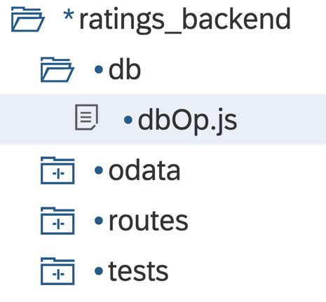
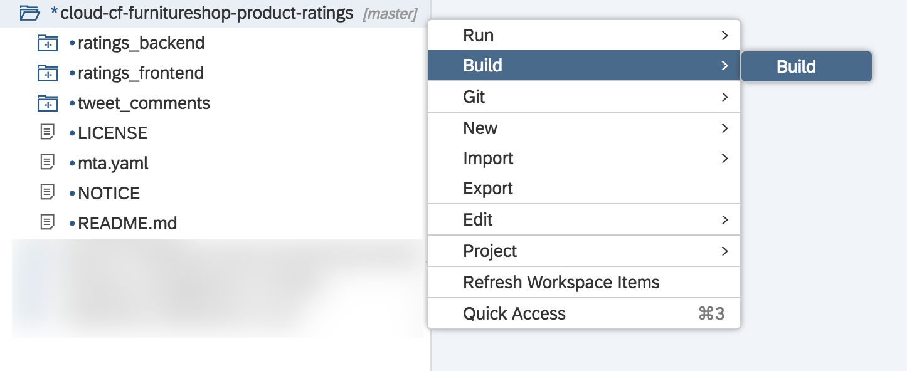
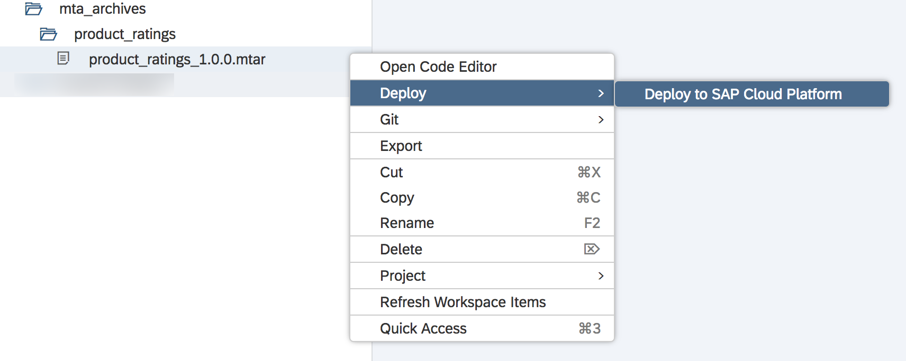
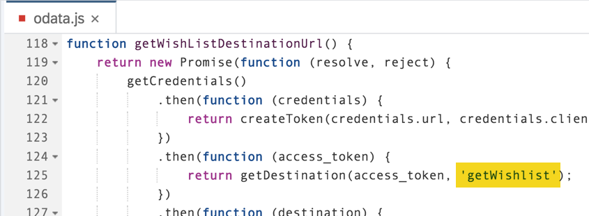
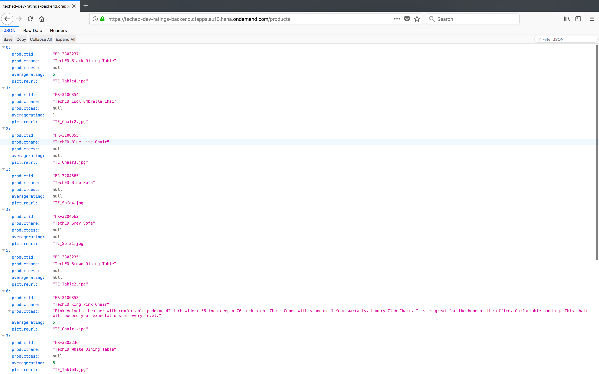

<a name="top"></a>
# Exercise 6 - Comments and Ratings

## Navigation

| Previous | | Next
|---|---|---|
| [Exercise 5 - Logging](../Exercise-05-Logging) | [Overview](../README.md) | [Exercise 7 - Comments and Ratings Frontend](../Exercise-07-Comments-and-Ratings-Frontend)


## Table of Contents
* [Introduction](#Intro)
* [Clone Exercise Content and Code Walkthrough](#Step1)
* [Read Wishlist Data](#Step2)
* [Deploy Application](#Step3)


<a name="Intro"></a>
# Introduction

## Business Scenario

We now switch to the persona of Mary. Mary is a loyal customer of the furniture franchise. She has access to the shop's customer portal, through which she can not only browse the product catalogue, but also see the wishlist items the shop is planning to stock.

Customers like Mary now have the ability to provide their feedback by adding ratings and comments on the products Frank and other furniture shop staff-members have uploaded to the wishlist.


## Technology choice

To help Mary provide her feedback, we will create a 'Comments and Ratings' micro-service.

We will follow the guidelines of a microservice-based architecture in which the application should be composed from a collection of loosely-coupled services.  The choice of technology used by every service is based on the skillset in the team and more importantly, on the requirements of the service.

With the SAP Cloud Platform Cloud Foundry environment, teams have the flexibility to pick technologies and databases that best fit their requirements.

To build a 'Comments and ratings' service that collects feedback from the furniture shop's broad customer base, we need to use a technology which is simple and can work at lightning speeds. Hence the natural choice is to go with Node.js.

For persistence, we require a simple, cost-effective, transactional database in which user's ratings and comments can easily be stored and retrieved. To satisfy this requirement, a relational database such as PostgreSQL is a good choice.

The communication between this transactional store and the master data store on SAP HANA, will be via OData calls.

In this exercise, we will create a Multi-Target Application [MTA], consisting of a Node.js module that provides REST API’s to add ratings and comments. During the deployment of the Node.js module, it will fetch the wishlist information from SAP HANA database that has been exposed as an OData service in [Exercise 4](../Exercise-04-Order-New-Items) and store it in a PostgreSQL database.

Once the ratings backend is available, we will build the front-end i.e. user interface in Exercise 7, which will display the wishlist in the form of a list view and allow the user to rate and comment on any product in the list.

Individual ratings and average ratings will be persisted in PostgreSQL and the average rating will also be pushed to SAP HANA. These ratings in SAP HANA will help Franck decide which products to order.

In Exercise 8, we will see that Mary’s comments on the furniture products can be pushed to Twitter to spread the word and encourage other customers/patrons to engage with the furniture shop. To cater for this requirement, we will use the asynchronous message-broker RabbitMQ in order to push messages to Twitter service.

## Important - Before we Begin

In the upcoming sections, you will be required to clone the exercise content from a given Git repository. In general, Node.js modules need to be built based on the requirement and cannot be easily templated. To explain relevant sections of the code, you will notice that certain parts/modules are commented. The exercises will guide you to uncomment individual pieces of code, while explaining the relevance of each piece and what it achieves.

Please take note that commenting/uncommenting will differ based on the type of file you are working with. Javascript files will consist of line comments "//". Please follow the instructions closely to have a smooth exercise experience.

[Top](Top)


<a name="Step1"></a>
## 1. Clone Exercise Content and Code Walkthrough

In this section, we will clone the exercise content from Git to SAP Web IDE Full-Stack.

1. Click on the _Home_ icon  on the navigation view.

1. On the main view of the home page, select _Clone from Git Repository_.

	 

1. Enter the git repository URL to clone from and click on 'Clone'.

    ```
    https://github.com/SAP/cloud-cf-furnitureshop-product-ratings.git
    ```

	

1. Click the development icon  on the navigation view, the cloned application is displayed; expand the application.

   

   As the version on the SAP Web IDE as recently updated, you can ignore the ES-Lint issues.

1. The application consists of 3 modules - `ratings_backend`, `ratings_frontend` and `tweets_comments`. In this exercise, we will focus on the `ratings_backend` module.

1. Open the `ratings_backend` module and navigate to the `package.json` file which lists all the packages that your module depends on.

    

    Note that the file contains dependencies on the following node/npm modules:

    

    * `pg-promise` - handles automatic connections and transactions to the Postgres database instance
    * `cfenv` - used to parse Cloud Foundry-provided environment variables
    * `amqplib` - used to make amqp clients for Node.js
    * `@sap\xsenv` - SAP provided module for working with environment variables
    * `@sap\xssec`- SAP provided module for Node.js Container Security API

[Top](Top)


<a name="Step2"></a>
# 2. Read Wishlist Data

In order to provide ratings (and comments) on products in the wishlist, the service will require the wishlist data published by the furniture shop. This data is stored in SAP HANA during Exercise 3. We will now have to read the wishlist data from Exercise 3 and persist the same in PostgreSQL.

Sharing of data between micro-services is always a difficult architectural decision. In this exercise, we simplify this choice by opting for duplication of data via OData APIs. Let us see how this is realised.

1. The entry point to `ratings_backend` module is the `app.js`.

    

1. In this file we initialise the PostgreSQL database and load the required data from the Wishlist service to PostgreSQL. You will see 2 methods - `initializeDB` and `uploadInitialData` which are used to achieve this. Uncomment these 2 methods.

    Note: To uncomment, select the commented lines and press Ctrl-/ (Control slash) or right-click over the selected lines and choose 'Toggle Line Comment'.

   

   These methods are defined in `dbOp.js` file under the `db` folder. Let us look at what these methods do.

   

1. Open `dbOp.js`  
    This module is used to perform all the required db operations.

   * The `initializeDB` function makes a connection to PostgreSQL with the help of `pg-promise` and creates 2 tables in PostgreSQL.

   * The `uploadInitialData` function makes a request to the OData endpoint of service 1 to get the wishlist and stores it in PostgreSQL tables.

   Uncomment the functions `initializeDB` and `uploadInitialData` in `dbOp.js`

   

1. We already understand that data sharing between the 'Wishlist' service and 'Ratings and Comments' micro-services will be realised by calling OData endpoints from Exercise 4. These requests are handled in `odata.js` file under `odata` folder.

   

   This is achieved using 2 functions (`readWishList` and `updateWishlistRating`).

   * `readWishList` is used to read Wishlist data from service 1. It looks for the destination where the OData endpoint is described. Once the OData URL is discovered, a GET request is made to     fetch the required data.

   * `updateWishlistRating` is used to share the average rating of a wishlist product to service 1. It looks for the destination where the OData endpoint is described. Once the OData URL is discovered, a PUT request is made to update average rating into the SAP HANA database.

   Uncomment both functions

1. The `route.js` module under the `route` folder is used to expose these functions as REST APIs. Have a look at this file to understand how this is achieved.

   

[Top](Top)


<a name="Step3"></a>
## 3. Deploy the Application

We will now build and deploy the application that has been built above. Please note that the build and deploy may take few minutes. Please use this deployment time to login to the Cloud cockpit and check the creation of backing service instances, service bindings and applications. The order mentioned in your `mta.yaml` file will be followed during the deployment. You can also keep an eye on the flow of the deployment by watching the console logs from Web IDE or using the CF CLI command - **`cf logs <app name> --recent`**.

1. Using your Files explorer in Web IDE, right click on the **`cloud-cf-furnitureshop-product-ratings`** folder, select _Build -> Build_ as shown in the picture below.

    

    Once the build is completed successfully, you will see a new folder created in your project with the name **`mta_archives`**.

1. Right click on the generated `.mtar` file **`product_ratings_1.0.0.mtar`**, select _Deploy -> Deploy to SAP Cloud Platform_ as shown in the picture below.

    

1. In the popup that appears, please enter the following details and click on Deploy

    

    ```
    Cloud Foundry API Endpoint: https://api.cf.eu10.hana.ondemand.com
    Organization: TechEd2018_OPP363
    Space: <select your space from the drop down list>
    ```

1. The `odata.js` file under the `odata` folder in our deployment will expect a destination by name `getWishList`. Note that we have already created this destination in Exercise

   

5. As the deployment of a Node.js application involves uploading and packaging a number of files and modules, the deployment via Web IDE might take some time. Please use this opportunity to login to the Cloud cockpit and check the creation of backing service instances, service bindings and applications. The order mentioned in your `mta.yaml` file will be followed during the deployment. You can also keep an eye on the flow of the deployment by watching the console logs from Web IDE or using the CF CLI command - **`cf logs <app name> --recent`**.

6. Once the deployment is successful, click on the url below _Application Routes_. The application opens in a new tab.

   

[Top](Top)


<hr>
© 2018 SAP SE
<hr>


# Navigation

| Previous | | Next
|---|---|---|
| [Exercise 5 - Logging](../Exercise-05-Logging) | [Overview](../README.md) | [Exercise 7 - Comments and Ratings Frontend](../Exercise-07-Comments-and-Ratings-Frontend)
