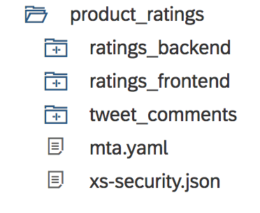
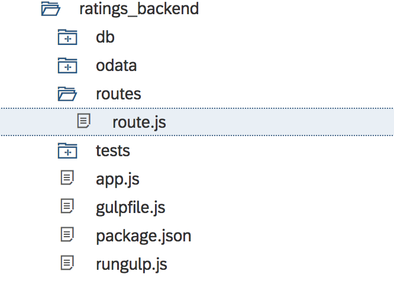

- - - -
Previous Exercise: [Exercise 3 - Logging](../Exercise3_Logging) Next Exercise: [Exercise 5 - Comments and Ratings Frontend](../Exercise5_Comments_and_Ratings_Frontend)

[Back to the Overview](../README.md)
- - - -

# Exercise 4 - Comments and Ratings

Mary is a loyal customer of the home furniture franchise. She has access to the shop's customer portal. The customer portal allows her to browse the stores product catalogue and see the whishlist items which the store is planning on stocking. The customer portal provides customers like Mary with the ability to add ratings and comments on products which Frank has uploaded to the wishlist.

We will create a business application (a Node.js module) which provide REST API’s to add ratings and comments. During the deployment of the Node.js module, it will fetch the required wishlist information on products from SAP HANA database which was exposed as OData in [Exercise 1](../Exercise1_Publish_Wishlist) and stored in PostgreSQL database. Once the data is available, the user interface which we will build in Exercise 5 calls the REST endpoint to display the wishlist content in the form of a list view. Individual ratings and average ratings will be persisted in PostgreSQL and the average rating will also be updated in SAP HANA. The centralized average ratings stored in SAP HANA will be used by Franck to help him decide which products to order.

Mary’s comments on the furniture products will also be pushed to RabbitMQ and this message will be consumed in Exercise 6 to publish it on to Twitter.

## I. Developer Guide

1. In this section, clone a git repository in SAP Web IDE Full-Stack.

    * Click on the _Home_ icon on the navigation view.

    * On the main view of the home page, select _Clone from Git Repository_.

        

    * Click the development icon on the navigation view, the cloned application is displayed; expand the application.

        


2. Our focus for this exercise is the ratings_backend module.

    * For a Node.js application `package.json` file is the core and it lists all the packages that your module depends on. For every application there is launch file which gets executed when the program is deployed.

        This launch file is specified in the `script` property under a start tag; in our case it is `app.js`.

        

    * Uncomment the code in `app.js`, here we initialize the PostgreSQL database and load the required data to PostgreSQL. Finally, we start the server.

        The 2 methods called in `app.js` (initializeDB and uploadInitialData) are defined in `dbOp.js` file under the `db` folder.

        

    * Refer to `dbOp.js`; it creates tables , makes connection to PostgreSQL with the help of `pg-promise`. All the required db operations are performed in this file.

        Uncomment the 2 functions (`initializeDB` and `uploadInitialData`) in `dbOp.js`;

        The `InitializeDB` function executes queries to create 2 tables and the `uploadInitialData` function makes a request to the OData endpoint of service 1 to get the wishlist and store it in PostgreSQL.

    * From the previous point we understand we call OData endpoints from Exercise 1; the requests are made in `odata.js` file under `odata` folder.

        

        There are 2 functions in this file (`readWishList` and `updateWishlistRating`). `readWishList` looks for the destination where the OData endpoint is described. Once the OData URL is discovered, a GET request is made to fetch the required data.

        `updateWishlistRating` looks for the destination where the OData endpoint is described. Once the OData URL is discovered, a PUT request is made to update average rating the SAP HANA database from Exercise 1.

    * Now that we have initialized PostgreSQL and populated the initial data, we need REST API’s to see what we have done in the above steps. We use the Express framework to respond to HTTP requests. Routing refers to how an application’s endpoints respond to client requests. We define routing using methods of the Express app object corresponding to HTTP methods; for example, `route.get` will handle get request and `route.post` will handle post request.

        

3. Create a destination which enables to call odata endpoint from Exercise 1.

    * Navigate to your space and select _Applications_ tab. Click on the `module 1` application. once selected click on _Service Bindings_, here you would see all the services associated with the application.

    * Click on the destination service and select _Destinations_ on the navigation view.

        

    * Click on _New Destination_. Below are the parameters for the destination.

        - Name: `getWishlist`
        - Type: `HTTP`
        - URL: `mention the application url of service1`

            Copy the URL from the app deployed at the end of Exercise 4.
            //TODO: Add the correct image.

        - Proxy type: `Internet`
        - Authentication: `NoAuthentication`

            

        * Click _Save_.

4. HTTP rest API’s are ready to be called from UI or could be tested from a REST client like Postman.

5. To test a get request go to your application click on the url below application routes. The application opens in a new tab.  To see the get response add “/products” after the host.

    


### II. Deploying the application
In this section you will build and deploy the application that you have built in Exercise 4.


1. Using your Files explorer in Web IDE, right click on the **`product_ratings`** folder, go to Build &rarr; and click on **Build** as shown in the picture below.

   

    Once the build is completed, you will see a new folder created in your Web IDE's Files explorer with the name **`mta_archives`**.

3. Using your Files explorer in Web IDE, right click on the generated .mtar file **`product_ratings`**, and go to Deploy &rarr; and click on **Deploy to SAP Cloud Platform** as shown in the picture below.

    

4. In the popup that appears, please enter the following details and click on Deploy

    

    ```
    Cloud Foundry API Endpoint: ``//TODO: Add the end point
    Organization: ``//TODO: Add your organization
    Space: Select your space from the drop down list
    ```
5. //TODO: @Sanjay to add the generic line about checking the services and logs as done in the earlier exercise.

6. Once your application is deployed launch the url for ratings_backend app with `/products` endpoint.


- - - -
© 2018 SAP SE
- - - -

Previous Exercise: [Exercise 3 - Logging](../Exercise3_Logging) Next Exercise: [Exercise 5 - Comments and Ratings Frontend](../Exercise5_Comments_and_Ratings_Frontend)

[Back to the Overview](../README.md)
