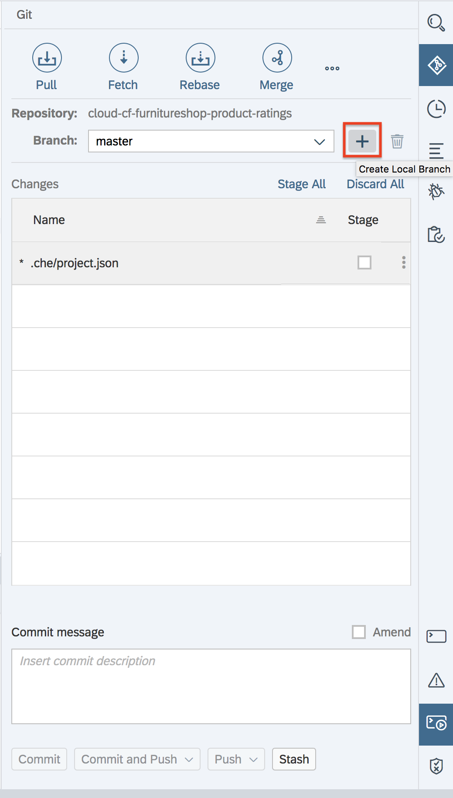
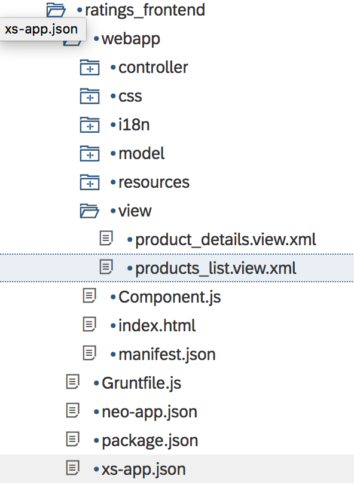
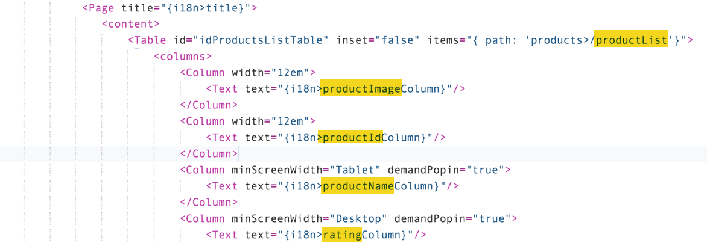
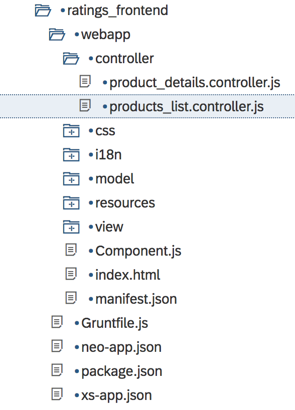
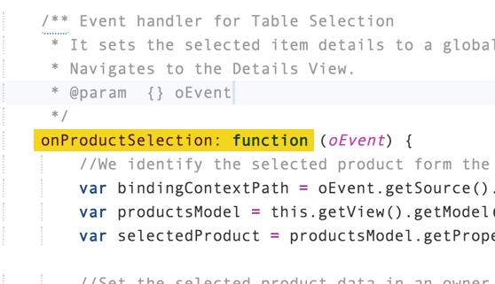
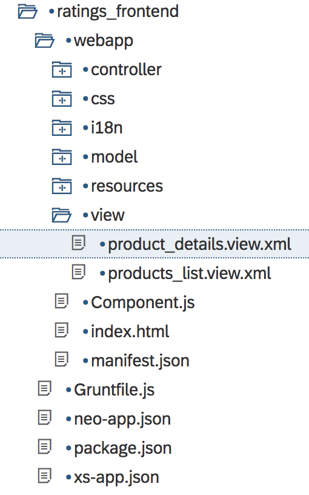
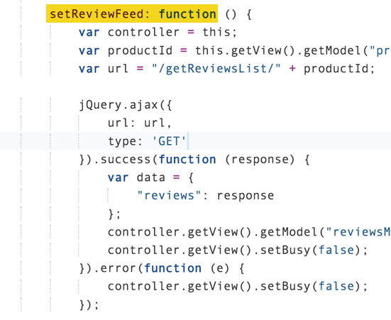
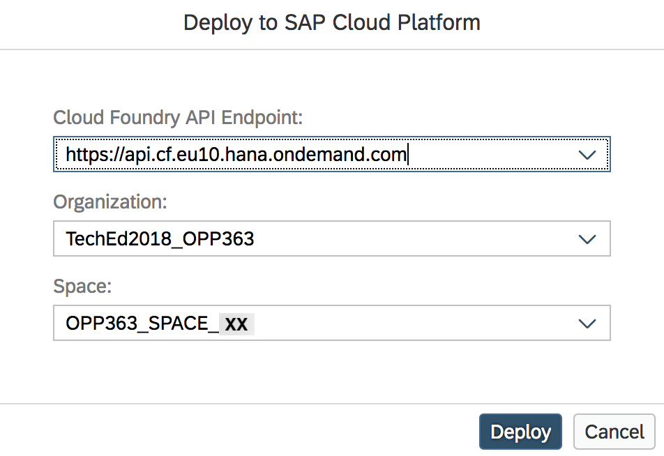
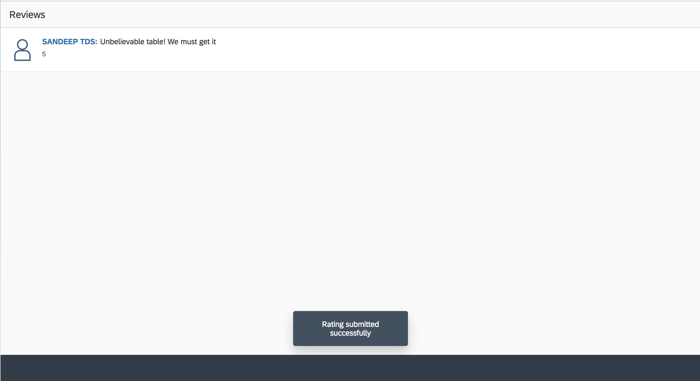
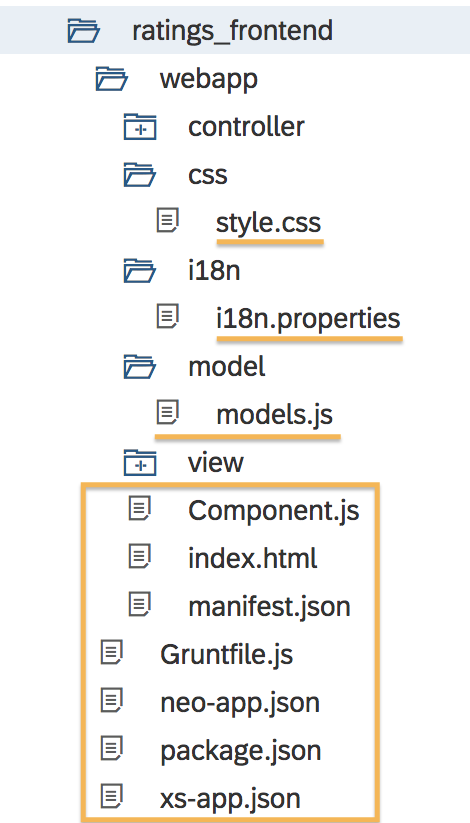

 - - -
Previous Exercise: [Exercise 6 - Comments and Ratings Backend](../Exercise-06-Comments-and-Ratings-Backend) Next Exercise: [Exercise 8 - Tweet Comments Backend](../Exercise-08-Tweet-Comments-Backend)

[Back to the Overview](../README.md)
- - - -
# Exercise 07 - Comments and Ratings Frontend

Now that we have the backend application of the `Comments and Ratings` backend service in place, in this exercise we will build the front-end application i.e. furniture shop's customer portal. The portal will allow customers like Mary to browse the store's product catalogue and view the wishlist items that the store is planning to stock.

Architecturally, we can either choose to consume microservices in a single UI via APIs or have every microservice develop it's own UI and use composition patterns to bring the UIs together. We have chosen to develop independent UIs for each microservice. Like we have done in previous UI modules, we will continue to use SAPUI5 as the technology of choice for front-end applications. We will now build the UI screens that will enable Mary to add ratings and comments on any product that Franck has uploaded to the wishlist.

## Overview
The customer portal will have two views.

1. Products List View - contains the Wish list items uploaded by the furniture shop(Franck) for its customers.

   

2. Product Details View - contains the details of a selected product

    The Product Details View will have two tabs.

    * Tab 1: Details - showing the details and image of the selected product

      

    * Tab 2: Rate Item - The logged in user/customer can provide ratings & comments, for a selected item from this tab.

      

   There is also a review feed which shows all the comments for the selected product.
   

## Important - before we begin

In the upcoming sections, you will be required to clone the exercise content from a given git repository. In general, Javascript modules need to be built based on the requirement and cannot be easily templated. To explain relevant sections of the code, you will notice that certain parts/modules are commented. The exercises will guide you to uncomment individual pieces of code, while explaining the relevance of each piece and what it tries to achieve. Please take note that commenting/uncommenting will differ based on the type of file you are working with. Javascript files will consist of line comments "//" where as UI5/xml files might use block comments with "/*.. */" format. Please follow the instructions closely to have a smooth exercise experience.

### 1. Clone exercise content

As a part of the previous exercise, we have cloned the content required for this exercise too.

If you have not done so, please follow the steps 1 to 4 mentioned [here](../Exercise-06-Comments-and-Ratings-Backend#1-clone-exercise-content-and-code-walkthrough)

We know that the cloned application consists of 3 modules - `ratings_backend`, `ratings_frontend` and `tweets_comments`. In this exercise, we will focus on the `ratings_frontend` module.

To start working on *Exercise 7*, the `ratings_frontend` module, we will switch to `exercise-7` branch in git.

1. Using your Git Pane, click on `Discard All` (Discard all unstaged changes in the list) as shown in the picture below.
    

2. In the confirmation dialog that appears, click on `Discard`.
    

3. Using your Git Pane, click on `+` (Create Local Branch) as shown in the picture below.

    

4. In the popup that appears, select the source branch as `origin/exercise-7` and enter the branch name as `exercise-7` and click on **OK**.

    

5. Refer to the image below and ensure that you have successfully checked out branch `exercise-7`

    


### 2. Setup the Products List view

In this section, we will setup the view and controller for products list view - a view that shows the wishlist of products.


1. Using your Files explorer in Web IDE, open the `ratings_frontend` module and navigate to the **`products_list.view.xml`** file under the **view** folder as shown in the picture below.

   

2. Check the code under the **`<pages>`** tag. We see that a table `idProductsListTable` with three columns Product Id, Product Name and Average Rating is created.

   

3. We also see that selecting a product from the list will call the event handler `onProductSelection`.

   

4. Let us check the corresponding controller for Product List. Open the **`products_list.controller`** file as shown in the picture below.

   

5. Uncomment the following methods
   * **`getProductsList`** - Fetches the products list from ratings_backend app

   

   * **`onProductSelection`** - Event handler for table row selection

   

        Note: To uncomment, follow these steps:
        1. Select the commented code
        2. Use the mouse Right click
        3. Select the 'Toggle Line Comment' option

### 3. Setup the Product Details view

In this section, we will setup the view and controller for product details view - a view that shows the details of a product and allows the logged in user to rate the product and add a review.

1. Open the **`product_details.view.xml`** file under the **view** folder as shown in the picture below.

   

2. Check the code under the **`<pages>`** tag.
    * We see that we create two tabs.
        * Details Tab - where the details of the selected product are displayed
        * Rating Tab - where the user can review the product and submit ratings

    

    * Underneath the tabs, all the review comments for the selected product are shown.

    

3. Let us check the corresponding controller for Product Details. Open the **`products_details.controller`** file as shown in the picture below.

   

4. Uncomment the following methods
   * **`setReviewFeed`** - fetches all the reviews for the selected product

   

   * **`onSubmitRatingButtonPress`** - saves the ratings/comments into the Postgres database. Triggers the calculation of average rating and send the same to HANA.

   

        Note: To uncomment, follow these steps:
        1. Select the commented code
        2. Use the mouse Right click
        3. Select the 'Toggle Line Comment' option

### 4. Deploying the application

In this section, we will build and deploy the application that has been built above.

1. Using your Files explorer in Web IDE, right click on the **`product_ratings`** folder, go to Build &rarr; and click on **Build** as shown in the picture below.

   

   Once the build is completed, you will see a new folder created in Files explorer with the name **`mta_archives`**.

2. Right click on the generated .mtar file **`product_ratings`**, and go to Deploy &rarr; and click on **Deploy to SAP Cloud Platform** as shown in the picture below.

   

3. In the popup that appears, enter the following details and click on Deploy

   

    ```
    Cloud Foundry API Endpoint: https://api.cf.eu10.hana.ondemand.com
    Organization: TechEd2018_OPP363
    Space: <select your space from the drop down list>
    ```
4. Once your application is deployed launch the url for `ratings_frontend` app. Your app should look like shown in the [overview section](#overview).

5. Select a product and go to the `Rate Item` tab in the Product Details view.

6. Give the product a rating and comment and click on submit, as shown in the picture below.

    

    This will add a review to the product as show below.

    


### Appendix - Understanding the HTML5 application code
*Please note that you don't have to make any changes to your code as a part of this step. This section is intended only to explain the SAP UI5 HTML application code*

When you create a SAP UI5 application using the SAP Web IDE, a file structure with all the relevant files are created such as *`style.css`*, *`i18n.properties`*, *`model.js`* etc.



Let us look at two files *`manifest.json`* and *`xs-app.json`* where you specify some crucial settings for the front end application.

#### manifest.json

* Global Model

    You have created models such as **`products`** in *`products_list.controller`*; and **`productDetails`** and **`userRatingModel`** in *`product_details.controller`*. These models are view specific, i.e. such models can only be accessed from the corresponding view and controller. To access models from any view, you can setup global models in the *`manifest.json`* file under the **`models`** section.

    You have used two global models in this app *`selectedProductModel`* and *`userInfo`*.

* UI App routing

    You use a router mechanism to navigate between different UI screens. You define the routes for your views in the *`manifest.json`* file under the **`routing` &rarr; `routes`** section

#### xs-app.json
* Backend routing

    To forward our request sent from ratings_frontend app to the backend app, we define routes under the **`routes`** section inside *`xs-app.json`*

### Further Reading
* [Starting point for SAPUI5 and Fiori](https://sapui5.hana.ondemand.com/)
* [SAP UI5 Icon explorer](https://sapui5.hana.ondemand.com/test-resources/sap/m/demokit/iconExplorer/webapp/index.html#)
* [Github code repository](https://github.com/SAP/cloud-cf-furnitureshop-product-ratings)

- - - -
© 2018 SAP SE
- - - -
Previous Exercise: [Exercise 6 - Comments and Ratings Backend](../Exercise-06-Comments-and-Ratings-Backend) Next Exercise: [Exercise 8 - Tweet Comments Backend](../Exercise-08-Tweet-Comments-Backend)

[Back to the Overview](../README.md)