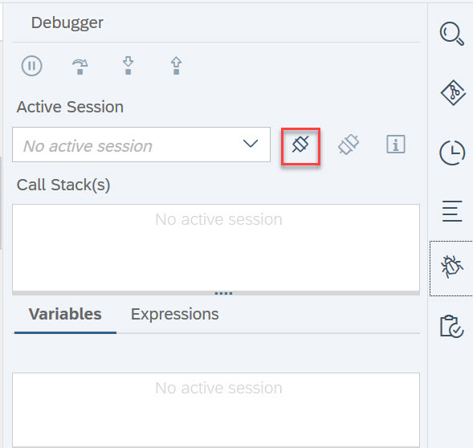
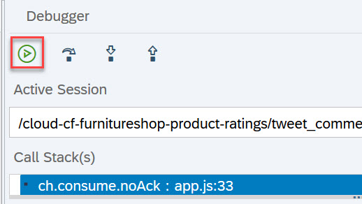

- - - -
Previous Exercise: [Exercise 08 Tweet Comments Backend](../Exercise-08-Tweet-Comments-Backend) Next Exercise: [Exercise-10 - Test Order New Items with User Input](../Exercise-10-Test-Order-New-Items-with-User-Input)

[Back to the Overview](../README.md)
- - - -

# Exercise 09 - Debugging

SAP Web IDE Full-Stack provides in-built support for debugging the cloud applications. Currently, [debugging of Java](https://help.sap.com/viewer/825270ffffe74d9f988a0f0066ad59f0/CF/en-US/a0f95901ab6c46a0b16c92eb313c6b08.html?q=debugging) and [debugging of Node.js](https://help.sap.com/viewer/825270ffffe74d9f988a0f0066ad59f0/CF/en-US/af6cc561014f4763837be143a4173a0a.html?q=debugging) applications are supported.

When a cloud applicaiton is run from within the Web IDE tool (using the _Run as_ option available for each module), you can attach a debugger to the running instance of the application.

In the previous exercises, you have deployed applications by first creating a _.mtar_ file by issuing a _Build_ command, followed by a command to _Deploy_ the mtar package to the SAP Clout Platform. In these cases, the debugger within the SAP Web IDE tool cannot easily attach to the running application instances. So, for the sake of the current exercise, we will first stop a running instance of an application (tweet_comments) created by the previous exercises, and instead run the module directly from within the Web IDE, in order to attach the debugger to the application instance.

This exercise demonstrates how to debug Node.js applications.  You can check out the above referenced documentation for debugging Java applications and other details.

## 1. Prepare an application (tweet_comments) instance for debugging
1. Open your SAP Cloud Platform cockpit and go to _Org - Space - Applications_.
2. Locate the `ratings_front` application and click on it. On Overview page for the applicaiton, click on the application URL under the Application Routes. Test the rating functionality and check the twitter page for the posted comments (as you did at the end of the previous exercise):
- Select a product from the list and navigate to the `Rate Item` tab. Give the product a rating and a comment and click on submit. The picture below shows an example but your screen will look different based on the product you selected and the input you have provided for rating and comment.

   

 - You can also check the review feeds for a particular product.

   

7. In your browser, go to this [twitter handle](https://twitter.com/sapfurnishop) to see your comment posted as a tweet.

   

    Twitter handle URL: https://twitter.com/sapfurnishop
3. Locate the `tweet_comments` application.
4. Stop the running instance of the `tweet_comments` applications

5. In the Web IDE Workspace, expand the project _cloud-cf-furnitureshop-product-ratings_, which created in the previous exercises.
6. Wait for a few minutes for the applicaiton to start

7. Test the product rating functionality again with the new version of the tweet_comments instace by following the procedure as described above in step 2 .

## 2. Attaching Debugger to an application instance
1.	In the Web IDE, launch the _Debugger_ by clicking on the Debugger icon on the menu bar on the right, or by selecting _View - Debugger_ from the menu bar on top.

2.	In the Debugger pane, click on the icon for Attach Debugger

3.	You should see a pop-up window to select a _Debug Target_ as shown below. Confirm the value of debug target and click on _OK_. You should see a notificaiton that the debugger is now successfully attached to the target application instance.
	

## 3. Debug the application instance
We are now ready to debug the application instance running on the SAP Cloud Platform.
1.	Once again, use the _ratings_frontend_ application to submit rating and comment for any of the products.  You may see a notification (typically in the bottom right corner) that the Debugger has suspended the application.

    Note that the frontend application has submitted the rating and comment successfully. We have attached the Debugger to the tweet_comment application, which is watching for the submitted comments on a RabbitMQ channel and is publishing the comments via tweets. Since the Debugger has suspended the tweet_comments application, we will not see any tweet going out for the comment you have submitted just now, until the Debugger resumes the application.

2.	Switch the Web IDE and notice that the Debugger pane is now showing the details of the suspended application such as the _Call Stack_ and values of the _Variables_.

3.	Enlarge the  _Variables_ window and lick on _Local - tweet - status_ to verify that the tweet message is as expected.

3.	You can now step-over, step-in or step-out of the current function. To resume the application, click on the icon as shown in the below picture.

4. You can now refresh the [twitter page](https://twitter.com/sapfurnishop) where you should see a new tweet for the posted comment. 

## 3. Cleanup
Let us now clean up by reversing the changes we applied for the current exercise.
1.	Detach the Debugger from the running application.

1.	Detach the Debugger from the running application.

2. Stop the Applicaiton instance from the Web IDE (to get a view as shown in the below picture, you may have to first minimize the Debugger view by clicking on the Debugger icon on the right-side menu bar)

2. Start the tweet_comments applicaiton instance from the _SAP Cloud Platform cockpit_

- - - -
© 2018 SAP SE
- - - -
Previous Exercise: [Exercise 08 Tweet Comments Backend](../Exercise-08-Tweet-Comments-Backend) Next Exercise: [Exercise-10 - Test Order New Items with User Input](../Exercise-10-Test-Order-New-Items-with-User-Input)

[Back to the Overview](../README.md)