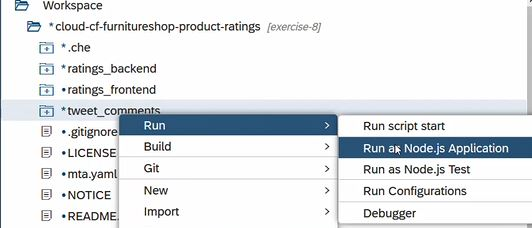
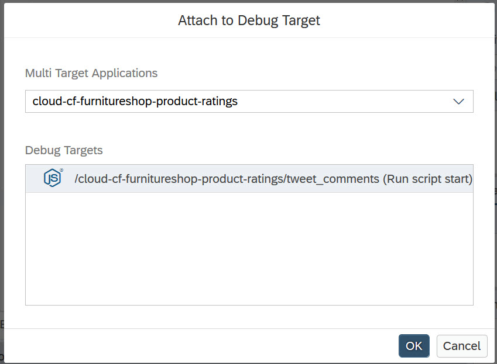
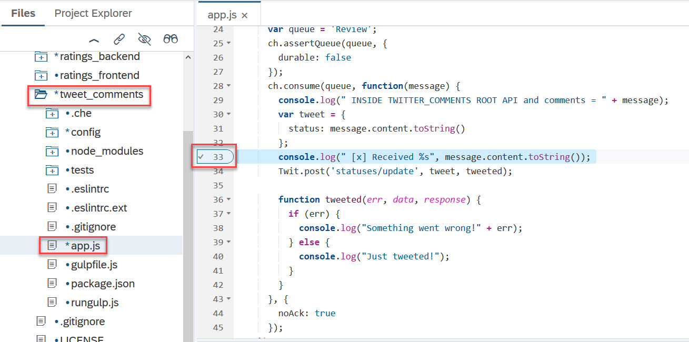
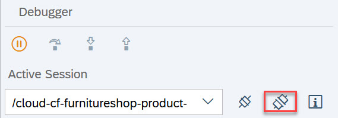

- - - -
Previous Exercise: [Exercise 08 Tweet Comments Backend](../Exercise-08-Tweet-Comments-Backend) Next Exercise: [Exercise-10 - Test Order New Items with User Input](../Exercise-10-Test-Order-New-Items-with-User-Input)

[Back to the Overview](../README.md)
- - - -

# Exercise 09 - Debugging

SAP Web IDE Full-Stack provides built-in functionality for debugging the cloud applications. Currently, [debugging of Java](https://help.sap.com/viewer/825270ffffe74d9f988a0f0066ad59f0/CF/en-US/a0f95901ab6c46a0b16c92eb313c6b08.html?q=debugging) and [debugging of Node.js](https://help.sap.com/viewer/825270ffffe74d9f988a0f0066ad59f0/CF/en-US/af6cc561014f4763837be143a4173a0a.html?q=debugging) applications are supported.

When an application is run from within the Web IDE tool (using the _Run as_ option available for each module), you can attach the debugger and debug that application instance.

In the previous exercises, you have deployed applications by first creating a _.mtar_ file by issuing a _Build_ command on the project, followed by a command to _Deploy_ the created mtar package to the SAP Clout Platform. In these cases, the debugger within the SAP Web IDE tool cannot attach to the running application instances. So, for the sake of the current exercise, we will first stop a running instance of an application (tweet_comments in our case), and instead start an application instance directly from within the Web IDE, in order to attach the debugger to the application instance.

This exercise demonstrates how to debug Node.js applications.  You can check out the above referenced documentation for debugging Java applications.

## 1. Prepare an application (tweet_comments) instance for debugging
1. Open your SAP Cloud Platform cockpit and go to _Space - Applications_.

1. Locate the `tweet_comments` application.

1. Stop the running instance of the `tweet_comments` application.

1. In the Web IDE Workspace, expand the project _cloud-cf-furnitureshop-product-ratings_, created during the previous exercise. Right-click on the tweet_comments module and select  _Run – Run as Node.js Application_.

1. Wait for a few minutes for the application to start

1. Let us test the overall porudct rating functionality using the newly created instance of the tweet_comments applications. Locate the `ratings_frontend` application and click on it. On Overview page for the application, click on the URL displayed under the Application Routes.

- Select a product from the list and navigate to the `Rate Item` tab. Give the product a rating and a comment and click on the _Submit_ button. Note that your screen will look different based on the product you selected for rating.
   

 - You can also check the review feeds for a particular product.

   

1. In your browser, go to this [twitter handle](https://twitter.com/sapfurnishop) to see your comment posted as a tweet.

   

## 2. Attaching Debugger to an application instance
1.	In the Web IDE, launch the _Debugger_ by clicking on the Debugger icon on the menu bar on the right (or by selecting _View - Debugger_ from the menu bar on top).

2.	In the Debugger pane, click on the icon for Attach Debugger

3.	You should see a pop-up window to select a _Debug Target_ as shown below. Confirm the value of debug target and click on _OK_. You should see a notificaiton that the debugger is now successfully attached to the target application instance.

4. Open the _tweet_comments/app.js_ file and set a breakpoint right before the function call for _Twit.post(...)_ by clicking on the line number.

## 3. Debug the application instance
We are now ready to debug the application instance running on the SAP Cloud Platform.
1.	Once again, use the _ratings_frontend_ application to submit rating and comment for any of the products.  You may see a notification (typically in the bottom right corner) that the Debugger has suspended the application.
  
    Note that the frontend application has submitted the rating and comment successfully. We have attached the Debugger to the tweet_comment application, which is watching for the submitted comments on a RabbitMQ channel and is publishing the comments via tweets. Since the Debugger has suspended the tweet_comments application, we will not see any tweet going out for the comment you have submitted just now, until the Debugger resumes the application.

2.	Switch the Web IDE and notice that the Debugger pane is now showing the details of the suspended application such as the _Call Stack_ and values of the _Variables_.

  

3.	Enlarge the _Variables_ window and navigate to _Local - tweet - status_ to verify that the tweet message is as expected.
  

4.	You can now step-over, step-in or step-out of the current function. To resume the application, click on the icon as shown in the below picture.
  

5. You can now refresh the [twitter page](https://twitter.com/sapfurnishop) where you should see a new tweet for the posted comment. 

## 4. Cleanup
Let us now clean up by reversing the changes we applied for the current exercise.
1.	Detach the Debugger from the running application.

2. Stop the Applicaiton instance from the Web IDE (to get a view as shown in the below picture, you may have to first minimize the Debugger view by clicking on the Debugger icon on the right-side menu bar)

2. Start the tweet_comments applicaiton instance from the _SAP Cloud Platform cockpit_

- - - -
© 2018 SAP SE
- - - -
Previous Exercise: [Exercise 08 Tweet Comments Backend](../Exercise-08-Tweet-Comments-Backend) Next Exercise: [Exercise-10 - Test Order New Items with User Input](../Exercise-10-Test-Order-New-Items-with-User-Input)

[Back to the Overview](../README.md)
