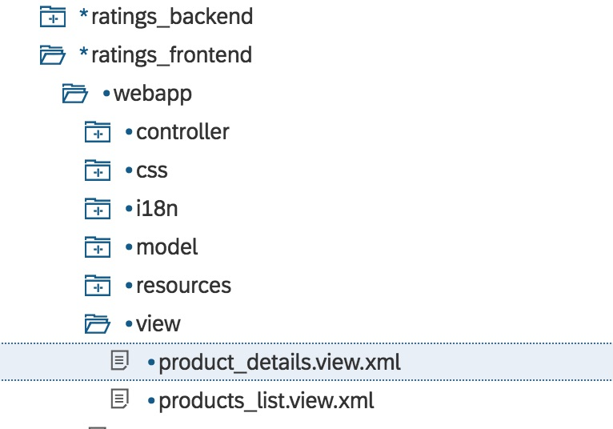

- - - -
Previous Exercise: [Exercise 09 - Autoscaling of Comments and Ratings](../Exercise-09-Autoscaling-of-Comments-and-Ratings) Next Exercise: [Exercise 11 - Test Order New Items with User Input](../Exercise-11-Test-Order-New-Items-with-User-Input)

[Back to the Overview](../README.md)
- - - -

# Exercise 10 - Blue Green Deployment of Comments and Ratings
In this exercise you will learn about blue green deployment of multi-target applications (MTA). 
##What is Blue Green deployment?
Blue-green deployment is a technique that reduces downtime and risk by running two identical production environments called Blue and Green.

At any time, only one of the environments is live, with the live environment serving all production traffic. For this example, Blue is currently live and Green is idle.

As you prepare a new version of your software, deployment and the final stage of testing takes place in the environment that is not live: in this example, Green. Once you have deployed and fully tested the software in Green, you switch the router so all incoming requests now go to Green instead of Blue. Green is now live, and Blue is idle.

This technique can eliminate downtime due to application deployment. In addition, blue-green deployment reduces risk: if something unexpected happens with your new version on Green, you can immediately roll back to the last version by switching back to Blue [(source)](https://docs.cloudfoundry.org/devguide/deploy-apps/blue-green.html).

Note: If there are database changes between versions, you may use [Blue-Green Deployment of Multi-Target Applications (MTA) with Database Changes](https://help.sap.com/viewer/65de2977205c403bbc107264b8eccf4b/Cloud/en-US/e62731aa735340bfb0c4b7c71b4bf5e7.html) but this is beyond the scope of this exercise.

## 1. Deploy a mutli-target application archive using blue green deployment
 In this exercise you will deploy the multi-target application archive that you built in [exercise 8](../Exercise-08-Tweet-Comments-Backend).  
 1. Begin by opening your WebIDE and navigate to the mta_archives folder. 
 
 
 2. Select the `product_ratings_1.0.0.mtar`, right click and choose **Export**.
 
 
    * The mtar file will be saved to your users downloads folder. You may move it to another folder for your convenience but we will further refer to the location of this file as the `mtar_location`.
 
 3. Next you will need to log into Cloud Foundry using the Command Line Interface (CLI), which you have set up in [Exercise 01](../Exercise-01-Setup). In the terminal window type `cf login`.
    
    
    
    * Make certain that the endpoint is `https://api.cf.eu10.hana.ondemand.com` otherwise, logout using: 
        
        `cf logout` and then log in using:
    
        `cf login https://api.cf.eu10.hana.ondemand.com`
        
 4. Select `TechEd2018_OPP363` as the `org` and `OPP363_SPACE_XX` as the space.
 5. Deploy the archive using blue green deployment with the command:
 
    `cf bg-deploy mtar_location/product_ratings_1.0.0.mtar`
    
    * This deployment may take several minutes. Once the deployment is complete, verify that the deployment completed successfully. Note that the suffix `-blue` has been appended to the name of each deployed application specified in the archive.
    
 6. Open the SAP Cloud Platform cockpit to validate the application and services are running correctly.
    * Log in to the [SAP Cloud Platform cockpit](https://account.hana.ondemand.com/cockpit).
    * Navigate to the correct space by selecting the Account `TechEd2018`, the Sub account `OPP363CF`, and the space `OPP363_SPACE_XX`.
    * You should see 3 new applications started in the **Applications** tab of your space:
        * ratings_backend-blue
        * ratings_frontend-blue
        * tweet_comments-blue
    * You will also see new routes for the **Blue** deployment by selecting the **Routes** tab.
    
    
    

## 2. Update the UI and re-deploy
 Next, you will make small changes to the user interface so that you can see a visible change in the application. You will then increase the version of the application and re-build and re-deploy the application using the blue green deployment command. This will result in new applications being deployed and new routes for these applications.
 1. Open the i18n.properties file using WebIDE.
 
 2. Update line **29** to read:
    ```angular2html
    submitButton=Submit & Tweet
    ``` 
 
 3. Open `product_details.view.xml` in WebIDE 
    
  * Replace lines **44** through **48** with the following:
     ```angular2html
        <List id="idReviewsList" items="{reviewsModel>/reviews}" noDataText="{i18n>noCommentsTitle}" growing="true" growingThreshold="10" growingScrollToLoad="true">
            <headerToolbar>
                <Toolbar>
                    <Title text="{i18n>reviewsTabTitle}" level="H2" />
                </Toolbar>
            </headerToolbar>
            <infoToolbar>
                <Toolbar>
                    <Label text="{i18n>feedInfoToolBar}"/>
                </Toolbar>
            </infoToolbar>
            <FeedListItem sender="{reviewsModel>username}" icon="sap-icon://person-placeholder" iconDensityAware="false" info="{reviewsModel>rating}"
                text="{reviewsModel>comments}" convertLinksToAnchorTags="All"></FeedListItem>
        </List>
     ```
 4. Open the `mta.yaml` file and change the `version` on line **4** to `1.0.2`.
 
 5. **Build** the project `mtar` file.
 
 6. **Export** the `product_ratings1.0.2.mtar` file to `mtar_location`.
 7. Deploy the archive using blue green deployment with the command:
     
        `cf bg-deploy mtar_location/product_ratings_1.0.0.mtar`
 8. Open the SAP Cloud Platform cockpit to validate the application and services are running correctly.
   * You should see 3 new applications started in the **Applications** tab of your space:
   * ratings_backend-green
   * ratings_frontend-green
   * tweet_comments-green
   * You will also see new routes for the **Green** deployment by selecting the **Routes** tab.
        
        
    


- - - -
© 2018 SAP SE
- - - -

Previous Exercise: [Exercise 09 - Autoscaling of Comments and Ratings](../Exercise-09-Autoscaling-of-Comments-and-Ratings) Next Exercise: [Exercise 11 - Test Order New Items with User Input](../Exercise-11-Test-Order-New-Items-with-User-Input)

[Back to the Overview](../README.md)
